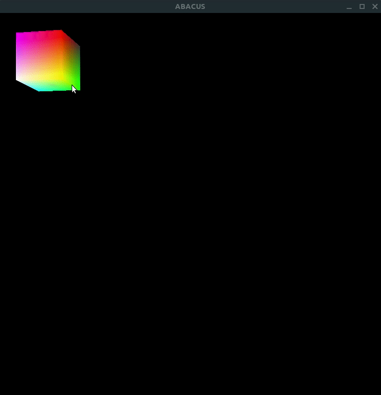

## Abacus Engine
---
I created this project to test my ability to write procedural data-oriented code.

This project has been inspired by [Handmade Hero](https://handmadehero.org/).

### Current State
---
Currently capable of rendering triangles directly to the X window buffer. The 3D code isn't permenant right now but enough to show the power of general triangle rendering! Coming soon is a font parser and text render.

Currently only compiles only linux. Simple compile just run make. The executable defaults to the bin directory.

